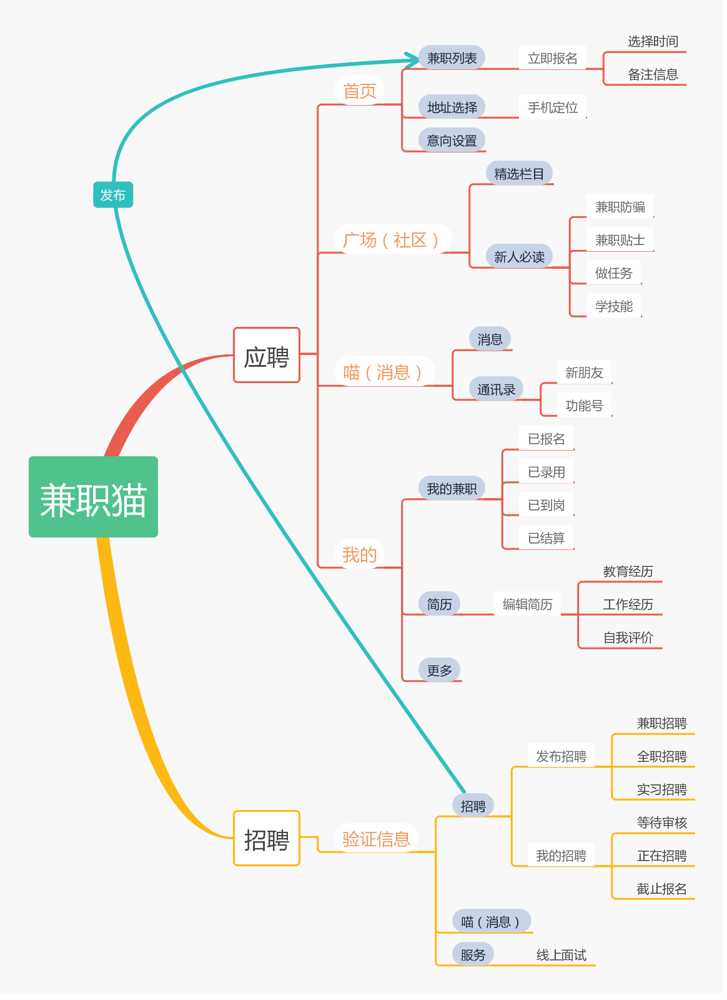
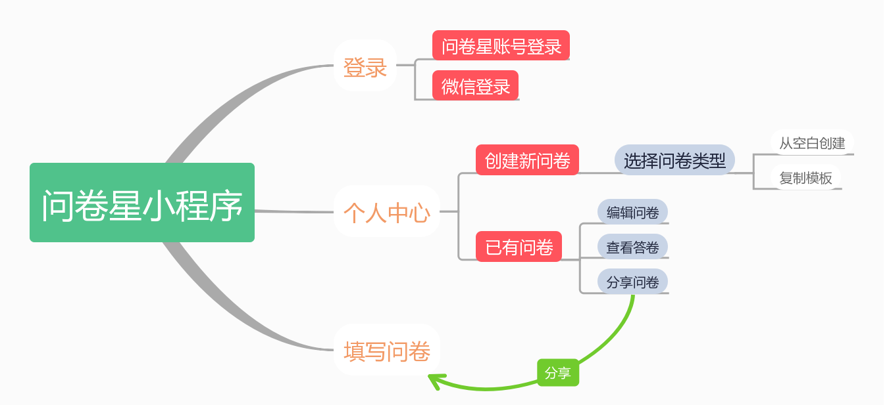
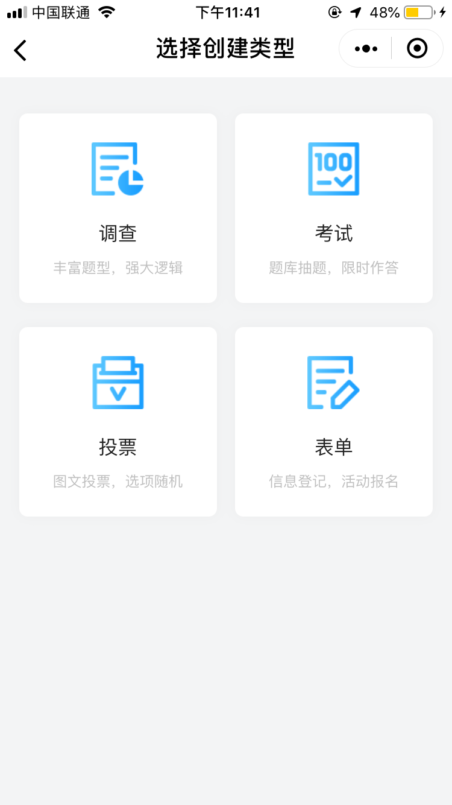
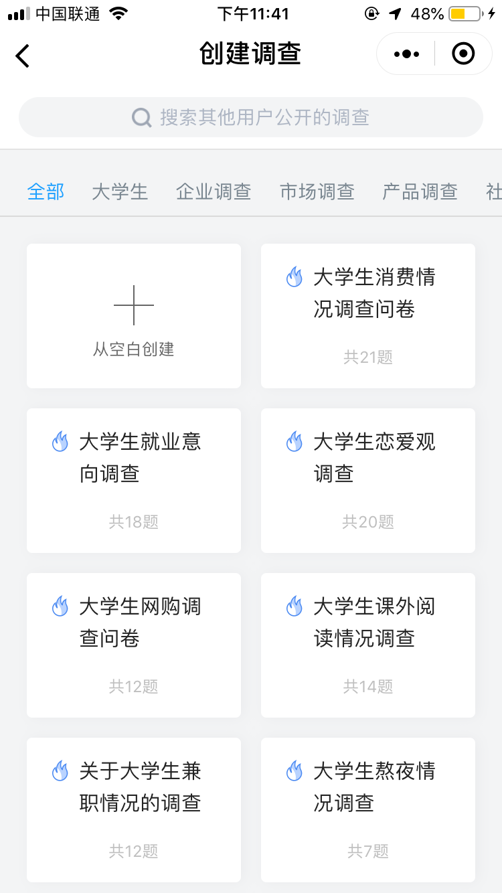

# 项目前期调研和竞品分析
## 背景
做兼职一直以来在大学生中是很流行的补贴生活的方式，很多大学生们都想要能够在不影响学习的情况下去挣取一些零钱，但是又不想通过兼职这么费时间的工作。只想着能够帮别人跑个腿之类的任务去赚取零钱。因此，这个机会就可以把握住。
 在如今市场上有很多面向社会各界人士寻找工作和兼职的程序和平台，但还基本没有面向大学生的兼职平台，并且各种平台也是良莠不齐，无法确保安全性，这也让确实想要赚取零钱的大学生望而却步。所以我们想通过开发微信小程序来触及到更多的未知与可能，将这一块市场进行开发。
 我们打算做的关于挣闲钱的小程序：在技术上，微信小程序越来越受人重视，开发成本也并不高；在功能上包括问卷，跑腿等任务。力求将小程序做到符合多方利益，努力为社会提供一个有利无弊的可靠的大学生赚零钱平台。在这种背景下，我们力所能及地进行了竞品调研，对线上找到的较优秀的产品做了体验和详尽分析，线下也对附近的商圈做了实地的考察，并亲测产品的可用性。
## 竞品分析报告
### 竞品列表

| | 兼职猫 | 同学帮帮 | 问卷星小程序 |
|--|--|--|--|
| 定位 | 围绕企业与个人需求，为求职者提供零工兼职岗位，为企业提供工作岗位发布、招聘服务 | 一款为大学生专属设计的手机应用。在这里，学生可以轻松找到靠谱兼职岗位，随时掌握南京校园新鲜事，分享和参与校园精彩活动。 | 是一个专业的在线问卷调查、测评、投票平台，专注于为用户提供功能强大、人性化的在线设计问卷、采集数据、自定义报表、调查结果分析系列服务。 |
| 特色功能 | 喵任务：帮助企业解决弹性劳务需求，推出操作简单的网上兼职  个性推荐：通过数据挖掘等手段，将兼职信息匹配每一位求职者  兼职旅行：满足一些想去旅行却囊中羞涩的大学生的需求 | 项目丰富：发单、调研、促销、服务员、家教、礼仪……  私人订制：根据个人简历或者想要锻炼的能力，推荐相应的兼职  社交平台：会员交流社区，可以和附近的人进行互动 | 企业：客户满意度调查、市场调查员工满意度调查、企业内训、需求登记、人才测评、培训管理  高校：学术调研、社会调查、在线报名、在线投票、信息采集、在线考试  个人：讨论投票、公益调查、博客调查、趣味测试 |
| 优点 | 超大信息量：比起其他招聘软件来说招聘信息比较丰富。有微信小程序。 | 适合想在校内的做一些兼职或者跑腿的大学生 | 功能丰富，并且有微信小程序，方便使用。 |
| 缺点 | 由于其定位和我们想要实现的软件不同，参考价值不大 | 在ios的app store上已经搜索不到，安卓上运行也不顺畅 |  |

### 交互设计与技术分析
#### 功能框架

新东西总要有些特色，但是特色总归是要解决用户的某种需求。三款APP首先都在信息可靠性上下了功夫。其次，兼职猫借助庞大的用户基数，发展增加用户体验，增强用户粘性的功能；微兼职的众包模式不是专门针对大学生的创新，用户范围广泛；同学帮帮是花样最多的APP，“靠谱”是做到让大学生放心，因此，深度介入用工过程，也为建立人才库打下基础，其中的社交平台更是同学帮帮“粘住”用户的法宝。但是，还是有些东西，他们都没有去做，就是兼职大学生安全保障问题。
### 商业模式分析
兼职APP上线初期，靠爬取兼职群或者网站上的兼职信息，积攒用户。之后，邀请商家入驻，收取服务费，或者承包业务，从中获利;发展到一定阶段，拥有了足够的用户与流量，兼职APP会接手广告业务或者进行招标的方式获利;如果该兼职APP能够足够优秀和幸运在市场上扎根，那么后续增加各种扩展服务遍及更多领域也是很好的一种商业模式。
### 竞品分析总结
兼职市场中需解决三大问题：去中介化、用工双方信任问题和人身安全问题。
- 首先，要想做到完全的去中介，是不可能的任务，终极情况不过就是兼职平台承包众商家的兼职业务，从而成为最大的中介；
- 再者，信任问题，这个是可以通过兼职平台有效地解决（提供担保），微兼职和同学帮帮都提供了很好的解决理念；
- 最后，大学生兼职过程中的人身安全问题，到现在为止，是没有人为此买单的，只是有人提出了“为所有兼职大学生买一份人身保险”的理想口号。

### 附录
图1

图2

图3

图4
