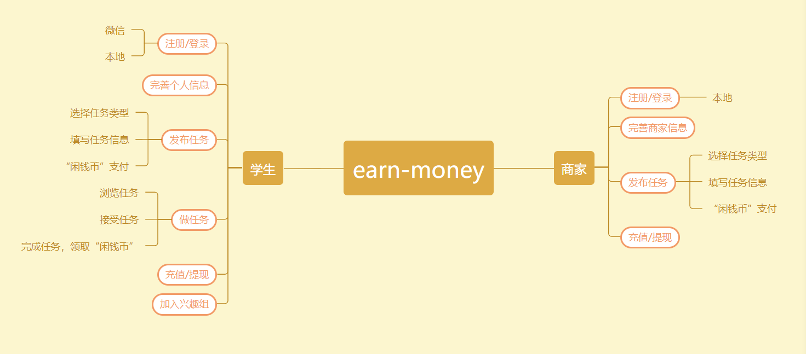
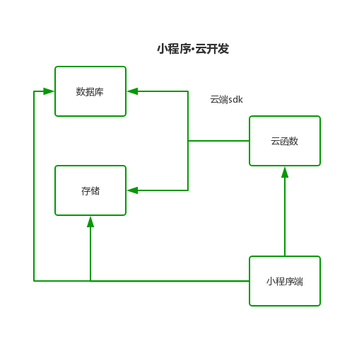
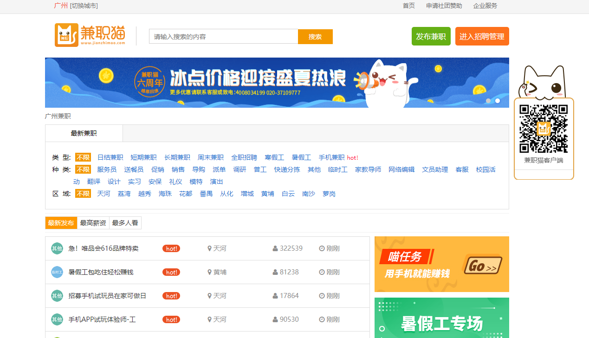
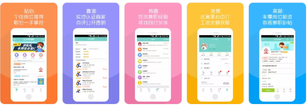

# 项目策划与愿景概述
## 项目愿景
### 项目背景
做兼职一直以来在大学生中是很流行的补贴生活的方式，很多大学生们都想要能够在不影响学习的情况下去挣取一些零钱，但是又不想通过兼职这么费时间的工作。只想着能够帮别人跑个腿之类的任务去赚取零钱。因此，这个机会就可以把握住。 在如今市场上有很多面向社会各界人士寻找工作和兼职的程序和平台，但还基本没有面向大学生的兼职平台，并且各种平台也是良莠不齐，无法确保安全性，这也让确实想要赚取零钱的大学生望而却步。所以我们想通过开发微信小程序来触及到更多的未知与可能，将这一块市场进行开发。 我们打算做的关于挣闲钱的小程序：在技术上，微信小程序越来越受人重视，开发成本也并不高；在功能上包括问卷，跑腿等任务。力求将小程序做到符合多方利益，努力为社会提供一个有利无弊的可靠的大学生赚零钱平台。在这种背景下，我们力所能及地进行了竞品调研，对线上找到的较优秀的产品做了体验和详尽分析，线下也对附近的商圈做了实地的考察，并亲测产品的可用性。
### 项目意义
- 帮助大学生实现兼职赚零钱的愿望目前市场上的求职软件非常多，同时也会涉及到面向大学生的兼职业务，但还没有一个在这个领域取得霸主地位的平台，同时各类网站也是良莠不齐，无法确保安全性，我们优化了学生在寻找兼职过程中的几个关键流程，大大减少了寻找目标兼职的时间，同时保证了数据信息的流通，利用微信小程序就如同在线上面对面交流一样安全，同时又能如同在线下一样方便。
- 解决商家与大学生之间交互的管理漏洞传统模式下兼职管理体系存在舞弊、跑单、出错、丢单、效率低等漏洞，这不仅让商家与大学生之间的交互有失公平性，同时也失去了最重要的安全性，同时这也是该领域没有哪一个产品成为龙头的主要原因。而我们设计的一体化流程就能避免这些漏洞，给兼职交互系统带来更简便的管理模式，减少出错和服务的压力。

### 项目可行性分析
- 在赚闲钱的项目中大家各取所需，没有输家，多方互利，共同发展。
- 在21世纪这个信息化的时代，微信小程序可以保证信息的快速流通，拥有了信息就相当于得到了机遇，拥有了时间就相当于掌握了主动权。
- 安全性更是最基本的要素，用户就像平常使用微信聊天一样使用小程序，无需更多平台，在绝对安全的情况下达到各自目的

## 项目介绍
### 项目概述
earn-money微信小程序的开发主要是为大学生们在上学期间，提供一个便捷的兼职的平台。大学生兼职随着社会的发展，也变得越来越普遍，越来越多的大学生选择在大学期间兼职，不但可以挣去在生活上的费用，而且还能锻炼自己对社会的适应能力。可以说很多大学生的兼职是他们这么大以来的第一份的工作，可以提前的为以后走进社会做准备。 earn-money微信小程序拥有资源集中，用户群体集中，需求集中等的特点。主要是为大学生用户群体服务，面对校内校外的兼职服务。并且大学生兼职是一个庞大的市场需求，每一所高校大学大部分的学生都做过兼职。
### 项目总体目标
- 本产品的用户群体是各类需要临时劳动力的中小型企业，以及所有在校大学生。我们的目标是在商家与学生之间搭建一个在校大学生可以随时兼职赚零钱以及为商家提供可靠临时劳动力的平台，为各类企业提供便利以及降低雇佣成本，为在校学生提供良好的兼职环境和体验。
- 我们项目团队的另一个重要目标是，在本学期践行面向对象的系统分析与设计方法，体验完整的软件开发流程。

### 平台功能设计
 
### 平台架构设计
 
## 市场分析
### 目标市场分析
大学生利用课余时间从事兼职活动是社会劳动的一种人力资源来源。从事大学生兼职的学生专业背景分布广泛,几乎涵盖所有学科,而其中以经济、贸易、营销、会计这类就业需求量大、面广的经管类专业为最多。大学生从事兼职的类型及范围主要是勤工俭学、实习、做家教、发传单、促销员、业务员、饭店服务员等服务性工作。当然,也有部分学生做其他相关自己专业领域的工作。
- 首先,企业部分岗位需要素质高、投入费用低的人力资源,往往将目标锁定在高校大学生身上。如市场调研公司在选聘调研人员、服务类企业招募临时促销员和翻译时都倾向于招聘知识资本和体力资本都很富足的大学生。
- 其次,整个社会对教育的重视,不断开阔的家教市场,家长将目标锁定在知识资本雄厚的大学生身上。此外,一些职业中介类组织机构的业务范围中也会包括大学生兼职

### 竞争分析
兼职市场中需解决三大问题：去中介化、用工双方信任问题和人身安全问题。
- 首先，要想做到完全的去中介，是不可能的任务，终极情况不过就是兼职平台承包众商家的兼职业务，从而成为最大的中介；
- 再者，信任问题，这个是可以通过兼职平台有效地解决（提供担保），微兼职和同学帮帮都提供了很好的解决理念；
- 最后，大学生兼职过程中的人身安全问题，到现在为止，是没有人为此买单的，只是有人提出了“为所有兼职大学生买一份人身保险”的理想口号。

### 关于竞品
下面是一些竞品项目，更多关于更具体竞品分析在<https://strugglers-sysu.github.io/Dashboard/documents/03_investigation.html>
 兼职猫:
 
 问卷星：
 .jpg)
 同学帮帮：
 
