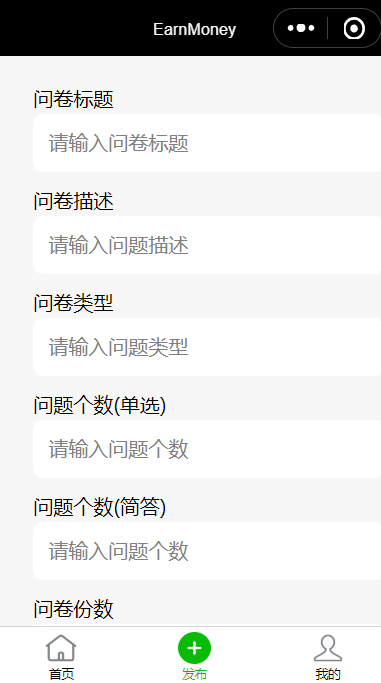
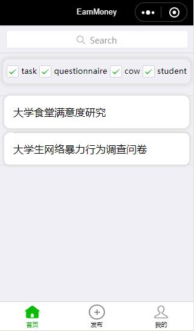

# 界面设计
## 设计规则说明
微信小程序设计的基本原则是微信设计中心针对在微信类上线的小程序页面总结的设计指南及建议。以下设计原则都是基于对用户的尊重的基础上的，旨在微信生态类建立有号、高效、一致的用户体验的同时，最大程度顺应和支持各业务需求设计，实现用户与程序的共赢。
- 有好礼貌：为了避免用户在微信中使用小程序服务时，注意力被周围复杂环境干扰，小程序在设计时应该注意减少无关的设计元素对用户目标干扰，礼貌地向用户展示程序侧提供的服务，友好地引导用户进行操作。
- 重点突出：每个页面都应有明确的重点，以便于用户每进入一个新页面的时候都能快速地理解页面内容，在确定了重点的前提下，应尽量避免页面上出现其他干扰项影响用户的决策和操作。
- 反例示意：页面最好是简单明了的，我们遵循 less is more 的设计观念，给用户一个更加容易直接的产品使用体验。比如页面的主题是查询，却添加了诸多与查询不相关的业务入口，与用户的预期不符，易造成用户的迷失。

## 小程序界面
### 登录注册

### 微信端授权

### 个人信息

### 发布问卷

### 问卷列表

