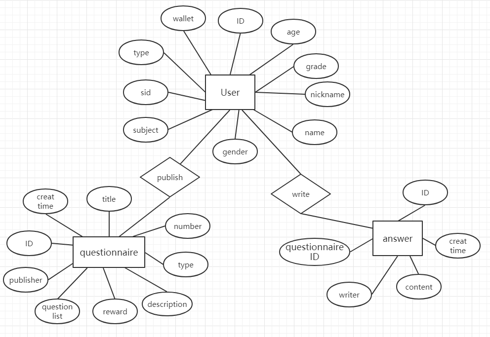

# 数据库设计

## 用户及任务数据库设计

### ER图

<a href="https://developers.weixin.qq.com/miniprogram/dev/wxcloud/basis/capabilities.html#数据库"> 云开发数据库文档</a> 
云开发提供了一个 JSON 数据库，顾名思义，数据库中的每条记录都是一个 JSON 格式的对象。一个数据库可以有多个集合（相当于关系型数据中的表），集合可看做一个 JSON 数组，数组中的每个对象就是一条记录，记录的格式是 JSON 对象。 
云开发提供了一块存储空间，提供了上传文件到云端、带权限管理的云端下载能力，开发者可以在小程序端和云函数端通过 API 使用云存储功能。
在小程序端可以分别调用 wx.cloud.uploadFile 和wx.cloud.downloadFile 完成上传和下载云文件操作。