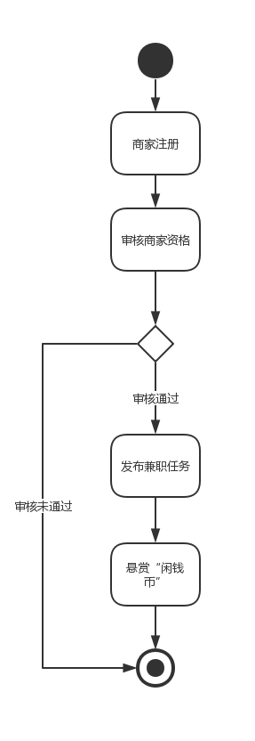
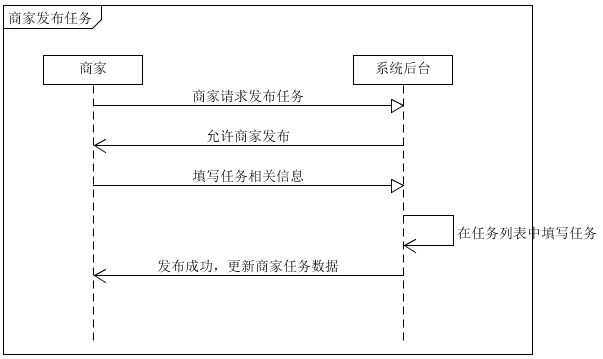

# 用例设计
## 基本用例：
- 注册/登录：组织机构和学生都可以作为一个独立的用户，可以进行注册、登录系统。
- 发布任务：组织机构可以面向学生发布相应兼职作为任务，学生也同样可以发布自己想让其他同学做的任务。
- 做任务：学生通过系统可以接受组织机构提供的任务，并完成这些相应的任务。
- 充值/提现：组织机构和学生都可以在各自账务充值现金作为“闲钱币”，“闲钱币”作为学生完成任务的奖励，同样组织机构和学生可以将“闲钱币”提取成现金。
- 加入兴趣组：学生可以加入兴趣组，互相交流评价，更容易找到适合的工作。
 

## 扩展用例：
- 微信登录：组织机构和学生可以选择使用微信账号作为登录方式，更加方便快捷。
 

## 包含用例：
- 完善个人/机构信息：在注册和登录完成后需要对本组织机构或本人的基本信息进行完善，以便于查找服务与系统推荐。
- 选择任务类型：组织机构或学生在发布任务时需要选择发布任务的类型。
- 填写任务信息：组织机构或学生在发布任务时需要填写所发布任务的具体信息。
- “闲钱币”支付：组织机构或学生在发布任务时需要支付一定数量的闲钱币作为悬赏。
- 浏览任务：学生在做任务前可以浏览当前已经发布的并且还未接受的任务。
- 接任务：学生可以决定接受相应的任务。
- 完成任务，领取“闲钱币”：学生在完成相应任务后，可以领取该任务作为悬赏的“闲钱币”。
 

## 主场景下的用户活动图

## 用例图

## 用户注册流程图

## 用户登录流程图

## 用户发布任务流程图

## 类图
