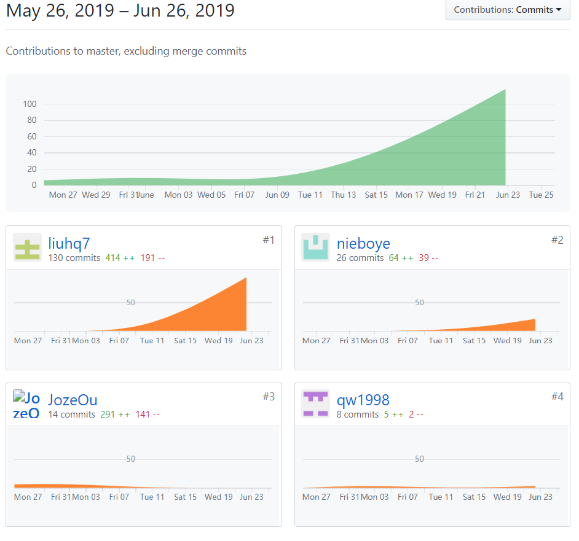
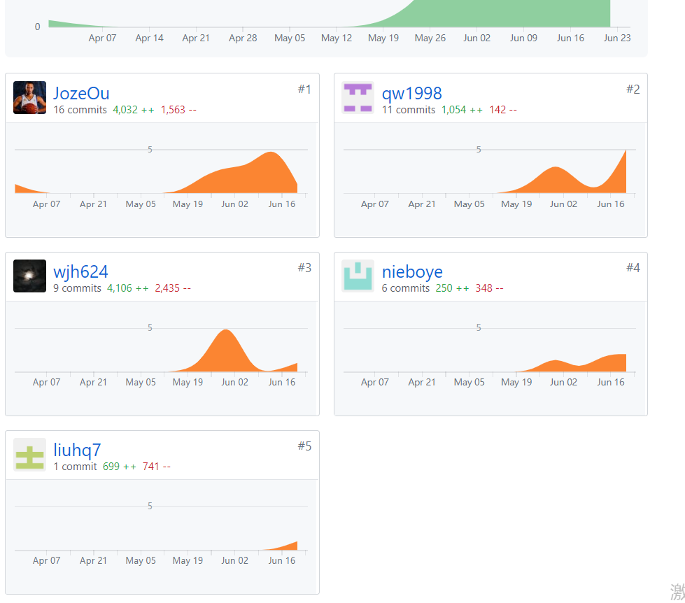

# 课程自我总结报告
from 16340148_liuhq7
## 自我总结
这学期我们小组做的微信小程序项目让我收益良多。
这次的课程设计也让我体验到了开发一个项目从头到尾应该做的各种事情。
这次项目也清楚了很多文档的书写要求和规范，亲自写了许多的文档，绘制了很多模型图。
在写文档的过程中巩固了我在课上学到的知识。
在GitHub项目管理中我们组长给了我很大的帮助。
其他的组员也对我帮助很大，无私奉献学习视频，不定期的分享一些技术博客，对一些问题的共同商量解决。
这学期的系分小组项目算是真正意义上做出一个有实际应用的产品，过程很漫长很艰难，不过总算是到了收尾的时候了，感觉收获了很多，很有锻炼意义。
## PSP 2.1 统计
| PSP2.1 | 预估耗时 | 实际耗时 |
|-----|-----|-----|
| Planning | 5 | 6 |
| Estimate | 5 | 5 |
| Development | 30 | 35 |
| Analysis | 3 | 3 |
| Design Spec | 1 | 1 |
| Design Review | 1 | 1 |
| Coding Standard | 2 | 2 |
| Design | 2 | 2 |
| Cosing | 10 | 12 |
| Test | 8 | 10 |
| Reporting | 2 | 2 |
## git统计清单

## 主要工作清单
| 最为满意或有价值的事情 | 简短说明 |
|-----|-----|
| 前期调研并编写文档 | 了解市场、竞品等相关信息，帮助我更加了解产品需求 |
| 团队管理及会议准备 | 探索一些激励机制提高团队积极性，管理GitHub pr，看板 |
| 绘制UML活动图、模型图 | 熟悉图型元素，更加了解项目，巩固课程内容 |
