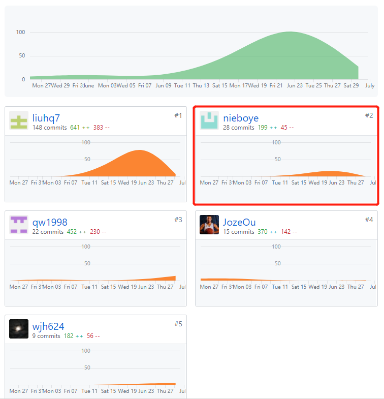
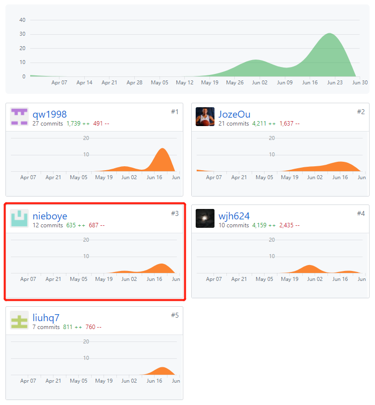

# 课程自我总结报告

## 16340171 - nieboye

## 自我总结

我的主要任务是后端开发，程序测试，设计文档的完成

我们为了简化后端开发，经过仔细探究，决定采用微信小程序云开发这种新的开发方式

之后便开始学习小程序云开发的官方文档，了解其提供的丰富的API来方便我们实现小程序数据的存取

并且在完成程序的同时进行文档的编写，主要完成了设计文档部分。

同时还了解到了小程序自定义组件的开发

## PSP 2.1 统计

| PSP2.1 |  |
|-----|-----|
| **Planning 计划** | 8 |
| Estimate 估计时间 | 8 |
| **Development 开发** | 64 |
| Analysis 需求分析（学习新技术） | 10 |
| Design Spec 生成设计文档 | 10 |
| Design Review 设计复审 | 3 |
| Coding Standard 代码规范 | 3 |
| Design 具体设计 | 10 |
| Cosing 具体编码 | 10 |
| Code review 代码复审 | 8 |
| Test 测试 | 10 |
| **Reporting 报告** | 18 |
| test report 测试报告 | 6 |
| size measurement 计算工作量 | 2 |
| Postmortem & Process improvement Plan 事后总结，并提出过程改进计划 | 10 |

## 最得意/或有价值/或有苦劳的工作清单

### 最得意

从0开始学习小程序的开发，大胆使用新的开发模式——小程序云开发，极大地简化了项目的后端开发工作。学会了一点自定义组件的开发。

### 最有价值

测试出若干小bug并组织修改。

### 最有苦劳

学习设计文档的书写并完成。ER图、领域模型图等部分图片的完成。

### 个人分支的 GIT 统计报告

### 文档

### Code

​

### 个人博客清单

[微信小程序自定义组件的开发](https://blog.csdn.net/a249648157/article/details/94366247)

## 特别鸣谢

多谢后端同学的指导和领导

感觉前端同学的努力，发烧依然奋战

辛苦写文档的同学