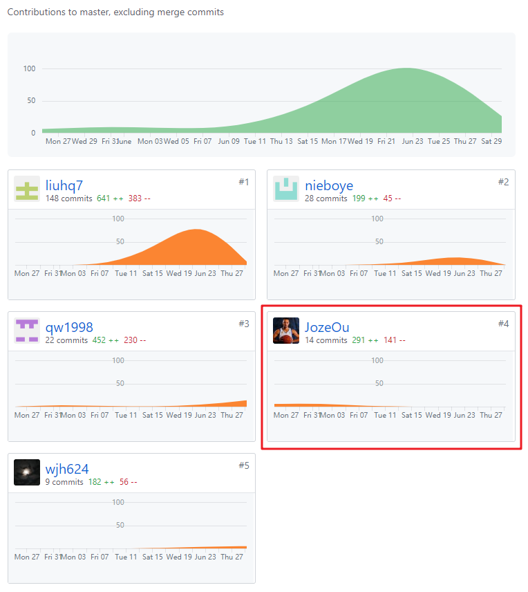
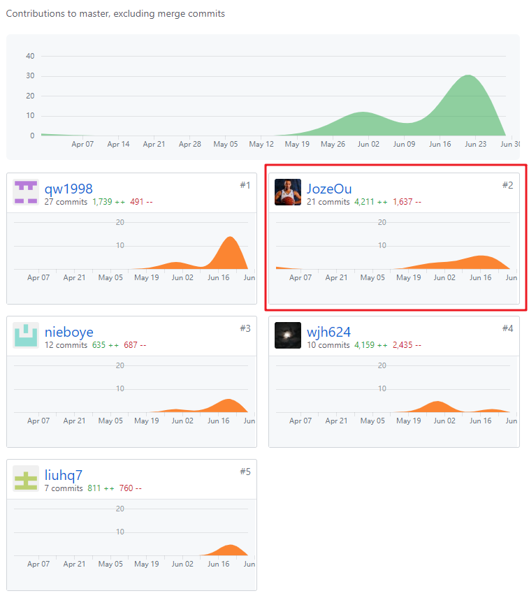

# 课程自我总结报告

## 16340172 - jozeou

## 自我总结

我的主要任务是后端选型，数据库设计，编码开发，管理团队

为了简化后端开发，经过认真讨论，决定采用微信小程序云开发这种新的开发方式

之后便开始学习小程序云开发的官方文档，了解其提供的丰富的API来方便我们实现小程序数据的存取

在前端开发基本成型后，便将前端表单提交的数据存储到云数据库，并实现登录，从云数据库中获取用户信息，任务列表等

由于学期课程多，难以投入大量时间，开发的程序只实现了基本要求。

## PSP 2.1 统计

| PSP2.1 |  |
|-----|-----|
| **Planning 计划** | 8 |
| Estimate 估计时间 | 8 |
| **Development 开发** | 80 |
| Analysis 需求分析（学习新技术） | 10 |
| Design Spec 生成设计文档 | 5 |
| Design Review 设计复审 | 3 |
| Coding Standard 代码规范 | 3 |
| Design 具体设计 | 10 |
| Cosing 具体编码 | 25 |
| Code review 代码复审 | 14 |
| Test 测试 | 10 |
| **Reporting 报告** | 12 |
| test report 测试报告 | 2 |
| size measurement 计算工作量 | 1 |
| Postmortem & Process improvement Plan 事后总结，并提出过程改进计划 | 9 |

## 最得意/或有价值/或有苦劳的工作清单

### 最得意

从0开始学习小程序的开发，快速掌握一个新技术；大胆使用新的开发模式——小程序云开发，极大地简化了项目的后端开发工作，加快项目进度，方便了前后端沟通。

### 最有价值

完成团队的组织工作，促进团队沟通、交流，统筹项目的开发工作，使项目稳定推进。

### 最有苦劳

完成后端的主要开发工作；期间遇到的主要问题：由于微信提供的云数据库访问权限受限，一些数据存取无法直接调用数据库API，经过查找解决方案，最终通过上传云函数并调用该云函数解决。

### 个人分支的 GIT 统计报告

### 文档

### Code

​

### 个人博客清单

[小程序云开发初体验](https://blog.csdn.net/For_course/article/details/94363269)

[微信小程序云函数的使用](https://blog.csdn.net/For_course/article/details/94363371)

## 特别鸣谢

其他四位小伙伴，合作愉快！

