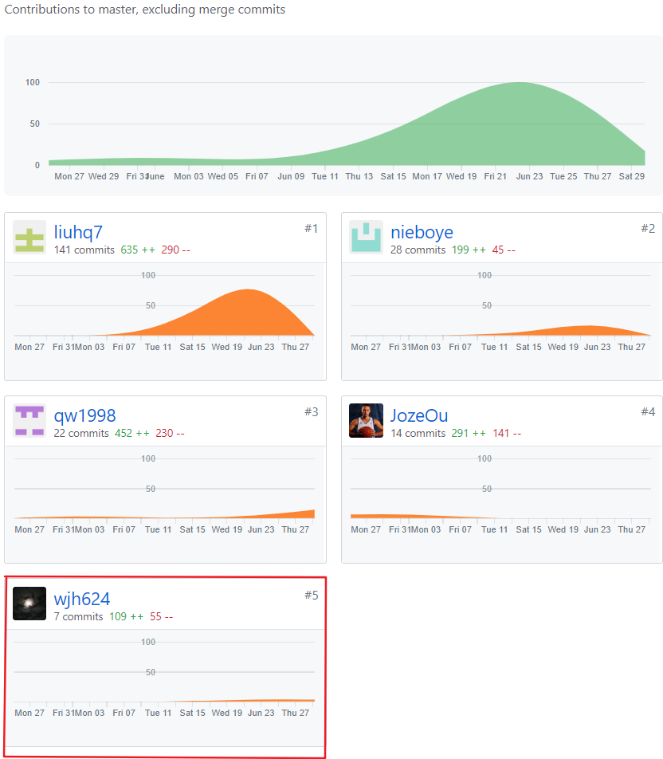
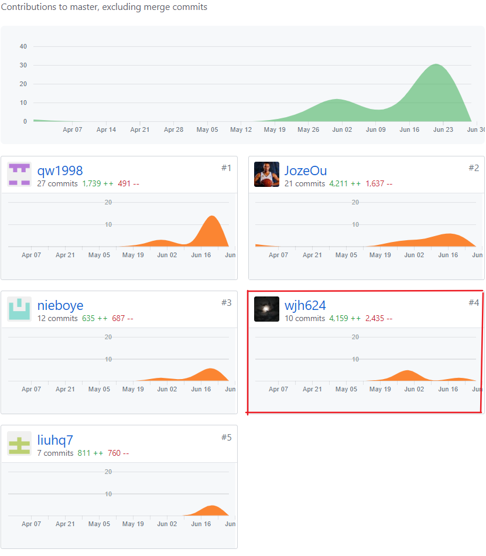

# 课程自我总结报告

## 16340216 - wjh624

## 自我总结

我的主要任务是做前端的开发，UI设计

前端用的是小程序端，学习了小程序端比较全面的开发知识，以及背后的运行原理

因为之前UWP，和web的前端开发经验，所以小程序的前端开发并不是很难，而且官方文档讲解的算是比较清楚，给的一些服务都是很方便的。感觉在未来，简单的前端开发工作将被机器人替代:cry:

后期18周将近发烧了一周，多靠各位队友帮忙。

## 最得意/或有价值/或有苦劳的工作清单

### 最得意

可能是兼顾了一下当UI设计师的责任，实现自己认为看着较好的UI设计，并且找了一个像微信一样简单的wx-ui官方UI作为我们统一的UI界面风格吧。

过了一下pm的瘾，组织了开会虽然没啥大的讨论内容。

### 最有苦劳

小程序里用checkou复选框实现的单选功能，竟然用radio-group就可以简单实现（当时没有查到），但是好在可以将checkout用于多选题目的选项限制上。

### 个人分支的 GIT 统计报告

### 文档

### Code

​	

## PSP 2.1 统计

| PSP2.1 |  |
|-----|-----|
| **Planning 计划** | 8 |
| Estimate 估计时间 | 8 |
| **Development 开发** | 85 |
| Analysis 需求分析（学习新技术） | 10 |
| Design Spec 生成设计文档 | 5 |
| Design Review 设计复审 | 3 |
| Coding Standard 代码规范 | 3 |
| Design 具体设计 | 10 |
| Cosing 具体编码 | 30 |
| Code review 代码复审 | 9 |
| Test 测试 | 10 |
| **Reporting 报告** | 7 |
| test report 测试报告 | 1 |
| size measurement 计算工作量 | 2 |
| Postmortem & Process improvement Plan 事后总结，并提出过程改进计划 | 4 |

## 特别鸣谢

前端小伙伴，后端的两位老哥，写文档的老哥

### 个人博客清单

[小程序单选功能实现](https://blog.csdn.net/hz2217/article/details/93096020)

