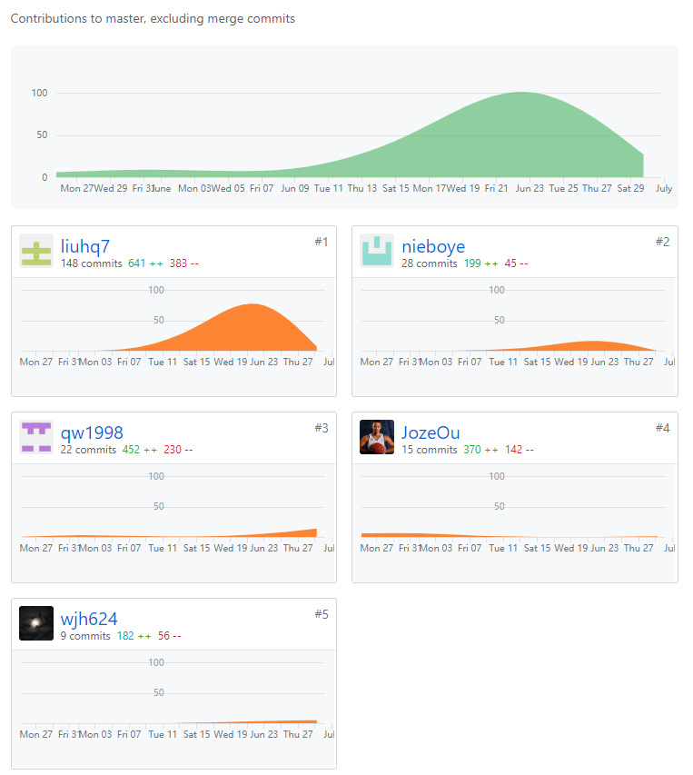
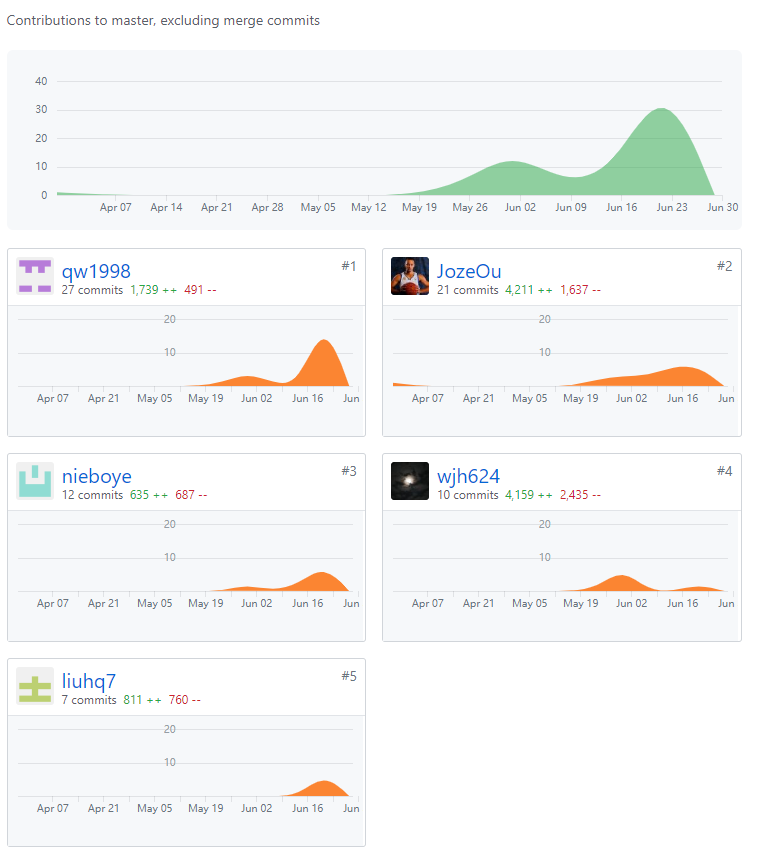

# 小组总结

## PSP2.1 汇总表

| 制品 | 内容 | jozeou | liuhq7 | nieboye | qw1998 | wjh624 |
| --- | --- | --- | --- | --- | --- | --- |
| 源代码 | 仓库earn-money | 30% | 10% | 5% | 25% | 30% |
| 分析与设计 | 需求分析 | - | 50% | 50% | - | - |
|  | UI设计 | - | - | - | 40% | 60% |
|  | 数据库设计 | - | 70% | 30% | - | - |
| 文档 | 仓库Dashboard | 10% | 45% | 30% | 10% | 5% |
| 综合贡献 |  | 22% | 18% | 19% | 20% | 21% |

## 项目所有仓库贡献图表截图

### 文档

### 源代码

​